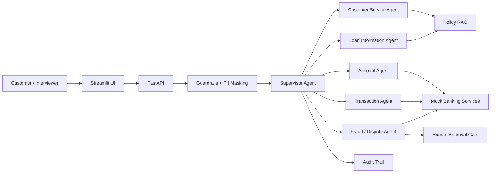

# BankAI — Generative + Agentic AI Digital Banking Platform

A portfolio-grade reference implementation showing how **Generative AI** and **Agentic AI** can work together in a regulated banking environment.

> **Portfolio disclaimer:** This project uses synthetic customers, accounts and transactions. It does not connect to a real bank, move real money, or make real credit decisions.

## Why this project
Traditional banking chatbots answer FAQs. BankAI demonstrates the next step: an AI assistant that understands a customer's intent, retrieves grounded policy information, calls controlled banking tools, coordinates specialist agents, requests human approval for sensitive actions, and records an audit trail.

## Showcase scenario
Customer: **“I don't recognize the ₹25,000 transaction. Check it and raise a dispute if required.”**

1. GenAI classifies the intent and creates a concise case summary.
2. The Orchestrator selects the Transaction Agent.
3. Transaction Agent retrieves the synthetic transaction through a controlled tool.
4. Fraud/Dispute Agent applies deterministic risk rules.
5. Guardrails decide whether human approval is mandatory.
6. A simulated dispute case is created only after the approval gate.
7. GenAI drafts a customer-friendly response.
8. Every action is written to the audit trail.

## Two end-to-end banking journeys

### Phase 1 — Transaction dispute
Customer query → GenAI intent → Transaction Agent → Fraud/Dispute Agent → risk/policy check → human approval → synthetic dispute → audit trail.

### Phase 2 — Agentic loan origination
Loan application → KYC Agent → Eligibility Agent → Risk Agent → human approval → simulated decision → audit trail.

Try Phase 2 through `POST /loan/apply`:
```json
{"customer_id":"C1001","amount":500000,"monthly_income":100000,"monthly_obligations":20000,"human_approved":false}
```
The first call deliberately stops at `HUMAN_APPROVAL_REQUIRED`. Set `human_approved` to `true` to demonstrate the controlled final step.

## GenAI capabilities
- Natural-language intent understanding
- RAG-style answers grounded in bank policy documents
- Transaction explanation and case summarization
- Customer response drafting
- PII masking before model-facing prompts

## Agentic AI capabilities
- Supervisor/Orchestrator Agent
- Customer Service Agent
- Account Agent
- Transaction Agent
- Fraud & Dispute Agent
- Loan Information Agent
- Tool selection and multi-step execution
- Human-in-the-loop approval gates
- Agent/action audit trail

## Architecture


## Run locally
```bash
python -m venv .venv
# Windows: .venv\Scripts\activate
# macOS/Linux: source .venv/bin/activate
pip install -r requirements.txt
uvicorn app.api.main:app --reload
```
Open `http://127.0.0.1:8000/docs` and try `POST /chat`.

Optional UI:
```bash
streamlit run app/frontend/streamlit_app.py
```

## Safety by design
BankAI intentionally separates **LLM reasoning** from **banking authority**. Sensitive actions are performed only by allow-listed tools. High-value disputes require human approval. Synthetic PII is masked in model-facing text. Audit events capture agent, tool, reason and outcome.

## Interview positioning
This is a **reference architecture and working prototype** built to demonstrate how a delivery leader can translate a banking use case into an AI-enabled product: business workflow, architecture, controls, backlog, APIs, testing, governance and measurable outcomes.

See [`docs/INTERVIEW_GUIDE.md`](docs/INTERVIEW_GUIDE.md) for a simple explanation and demo script, and [`docs/PHASE2_LOAN_ORIGINATION.md`](docs/PHASE2_LOAN_ORIGINATION.md) for the Phase 2 design.