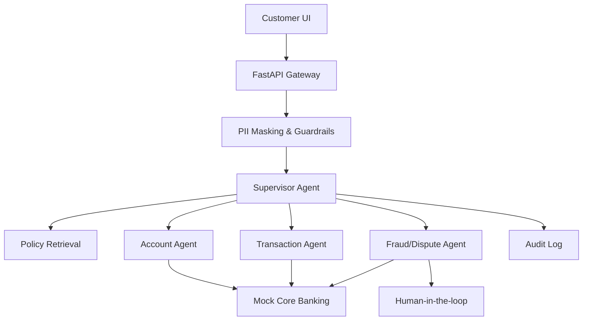

# Solution Architecture

The LLM/GenAI layer does not directly own privileged banking operations. Agents can call only approved tools, and sensitive workflows pass through deterministic policy controls.
